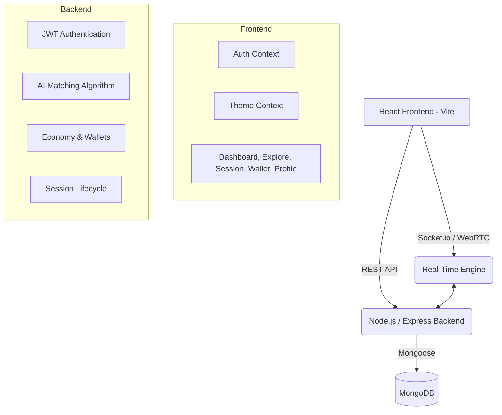

# PeerLearn - P2P Learning & Micro-Tutoring Platform

## Pitch (For Hackathon Judges)
**"PeerLearn is a dynamic peer-to-peer micro-tutoring platform that transforms every student into both a learner and a teacher."**
Traditional tutoring is expensive, and students often struggle to find immediate help tailored to their specific needs. At the same time, many students have exceptional knowledge in specific subjects but lack an accessible way to monetize or validate those skills. 
PeerLearn solves this by offering an AI-matched, gamified ecosystem where students can seamlessly book on-demand live sessions, earn "Coins" for teaching, spend Coins for learning, and build a verified portfolio of micro-credential badges.

## Unique Innovations (Hackathon Edge)
1. **Coin-Based Economy:** A self-sustaining micro-economy where teaching fuels your ability to learn elsewhere.
2. **AI Tutor Matching System:** A weighted algorithm (Subject, Level, Rating, XP, Streak) connecting you instantly with the most effective peer tutor.
3. **WebRTC Built-in Sessions:** No external Google Meet links needed. Seamless video, audio, and chat directly in the browser to reduce friction.
4. **Gamification Engine:** Daily streaks, XP points, leaderboards, and achievement badges to incentivize continuous engagement.

---

## 1. System Architecture Diagram



## 2. Database Schema

- **User**: Name, Email, Password, Skills (Teaching/Learning), Coins, XP, Level, Streak, Badges, Rating.
- **Session**: Tutor ID, Learner ID, Subject, Type (video/chat), Status, Room ID, Coin Cost, Duration.
- **Review**: Session ID, Reviewer, Reviewee, Rating, Comment, Tags.
- **Transaction**: User ID, Type (earn/spend/bonus), Amount, BalanceAfter.
- **Notification**: User ID, Type, Message, Read state.

## 3. API Structure

| Route | Method | Description |
|-------|--------|-------------|
| `/api/auth/register` | POST | Register & assign 100 coin signup bonus |
| `/api/auth/login` | POST | Login & evaluate daily streak |
| `/api/matching?subject=X`| GET | AI algorithm scores & returns top 10 tutors |
| `/api/sessions/request` | POST | Create session & notify tutor |
| `/api/sessions/:id/start` | POST | Deducts coins from learner |
| `/api/sessions/:id/end` | POST | Rewards tutor with 80% coins & bonus XP |
| `/api/rewards/wallet` | GET | Fetch transaction history & current balances |

## 4. Frontend Component Structure
```
src/
├── App.jsx            (Routing & protected layout)
├── main.jsx           (Providers: Auth, Theme, Router)
├── context/
│   ├── AuthContext    (JWT state & Demo login)
│   └── ThemeContext   (Dark/Light mode switcher)
├── components/
│   └── Sidebar        (Nav, level progress, coin balance)
└── pages/
    ├── Auth           (Animated login/signup with subject selector)
    ├── Dashboard      (XP progress, daily streak bonus, recommended tutors)
    ├── Explore        (Filtering & matching tutors)
    ├── Profile        (Gamified profile, editable skills)
    ├── Session        (WebRTC layout, chat, live timer)
    ├── Leaderboard    (Rankings by XP/Coins/Streaks)
    └── Wallet         (Transactions, earn methods, packages)
```

## 5. Monetization Strategy
- **Platform Fee:** PeerLearn takes a 20% cut of the coin transaction during sessions (e.g., Session costs 20 coins -> Tutor earns 16 coins -> Platform burns 4 coins to maintain economy).
- **Frictionless Top-ups:** Users can purchase Coin packages (e.g., $2.49 for 150 coins) using fiat to fast-track their learning without having to teach first.
- **Premium Features:** Future recurring subscription ($4.99/mo) for enhanced search filters, unlimited session recording, and exclusive profile badges.

---

## 🚀 Running Locally

1. Create terminal 1 (Backend):
```bash
cd server
npm install
npm run dev
```

2. Create terminal 2 (Frontend):
```bash
cd client
npm install
npm run dev
```

*(Note: Ensure you have a local MongoDB running or replace the connection string in server/.env with a MongoDB Atlas URI).*
